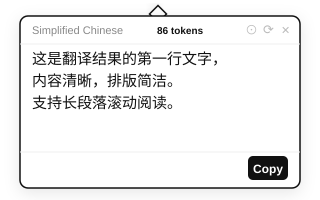
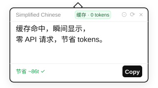
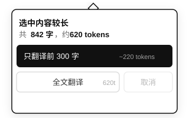
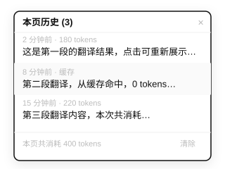

# AI Translate Extension

[English](#english) | [中文](#中文)

---

## 中文

### 预览

| 翻译结果 | 缓存命中 | 长段提醒 | 历史记录 |
|:---:|:---:|:---:|:---:|
|  |  |  |  |

### 安装

1. 下载或克隆本项目。
2. Chrome 地址栏输入 `chrome://extensions` 回车。
3. 打开右上角 **开发者模式**。
4. 点击 **加载已解压的扩展程序**，选择包含 `manifest.json` 的文件夹。

### 配置

1. 点击扩展图标 → **Settings**。
2. 填写 Base URL、Model 和 **API Key**（必填）。
3. 点击 **Test connection** 测试，成功后点击 **Save**。

> 默认配置：火山引擎 ARK + DeepSeek，可替换为任意 OpenAI 兼容接口。

### 使用

#### 划词翻译
在页面上选中文字，翻译弹窗自动出现。

- 选中超过 800 字会提示截断或全文翻译
- 点击 **Pin** 图标固定弹窗，防止误触关闭
- 点击 **历史图标** 查看本页翻译记录，可点击条目查看原文与译文对照
- 同段文字只翻译一次，再次选中直接从缓存显示（关闭浏览器后清除）

#### 全文翻译
点击扩展图标 → **Translate Page**，页面右下角显示进度，翻译完成后可点击浮窗切换原文/译文。

---

## English

### Preview

| Result | Cached | Long-text warning | History |
|:---:|:---:|:---:|:---:|
|  |  |  |  |

### Install

1. Clone or download this repo.
2. Open `chrome://extensions` in Chrome.
3. Enable **Developer mode**.
4. Click **Load unpacked** and select the project folder.

### Configuration

1. Click the extension icon → **Settings**.
2. Enter Base URL, Model, and **API Key**.
3. Click **Test connection**, then **Save**.

> Defaults to ARK + DeepSeek. Works with any OpenAI-compatible API.

### Usage

#### Inline Translation
Select text on any page — a popup appears automatically.

- Selecting over 800 characters shows a truncate/full-text prompt
- Click **Pin** to keep the popup open while reading
- Click the **history icon** to browse past translations; click any entry for a side-by-side original/translated view
- Same text is only translated once per session (cache clears when browser closes)

#### Full Page Translation
Click the extension icon → **Translate Page**. A widget appears at the bottom right — click it to toggle between original and translated text.
